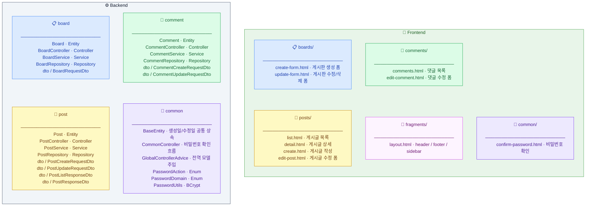

# OneLog 전체 구조

```mermaid
graph LR
    classDef board   fill:#dbeafe,stroke:#3b82f6,color:#1e40af
    classDef comment fill:#dcfce7,stroke:#16a34a,color:#166534
    classDef post    fill:#fef9c3,stroke:#ca8a04,color:#713f12
    classDef common  fill:#ede9fe,stroke:#7c3aed,color:#4c1d95
    classDef frag    fill:#fdf4ff,stroke:#d946ef,color:#701a75

    subgraph BACK["⚙️  Backend"]
        BOARD_J["📋 board
        ─────────────────────────
        Board · Entity
        BoardController · Controller
        BoardService · Service
        BoardRepository · Repository
        dto / BoardRequestDto"]:::board

        COMMENT_J["💬 comment
        ─────────────────────────
        Comment · Entity
        CommentController · Controller
        CommentService · Service
        CommentRepository · Repository
        dto / CommentCreateRequestDto
        dto / CommentUpdateRequestDto"]:::comment

        POST_J["📝 post
        ─────────────────────────
        Post · Entity
        PostController · Controller
        PostService · Service
        PostRepository · Repository
        dto / PostCreateRequestDto
        dto / PostUpdateRequestDto
        dto / PostListResponseDto
        dto / PostResponseDto"]:::post

        COMMON_J["🔧 common
        ─────────────────────────
        BaseEntity · 생성일/수정일 공통 상속
        CommonController · 비밀번호 확인 흐름
        GlobalControllerAdvice · 전역 모델 주입
        PasswordAction · Enum
        PasswordDomain · Enum
        PasswordUtils · BCrypt"]:::common

        BOARD_J  ~~~ POST_J
        COMMENT_J ~~~ COMMON_J
    end

    subgraph FRONT["🎨  Frontend"]
        BOARD_T["📋 boards/
        ─────────────────────────
        create-form.html · 게시판 생성 폼
        update-form.html · 게시판 수정/삭제 폼"]:::board

        COMMENT_T["💬 comments/
        ─────────────────────────
        comments.html · 댓글 목록
        edit-comment.html · 댓글 수정 폼"]:::comment

        POST_T["📝 posts/
        ─────────────────────────
        list.html · 게시글 목록
        detail.html · 게시글 상세
        create.html · 게시글 작성
        edit-post.html · 게시글 수정 폼"]:::post

        COMMON_T["🔧 common/
        ─────────────────────────
        confirm-password.html · 비밀번호 확인"]:::common

        FRAG["🧩 fragments/
        ─────────────────────────
        layout.html · header / footer / sidebar"]:::frag

        BOARD_T  ~~~ POST_T
        COMMENT_T ~~~ FRAG
    end

    BACK ~~~ FRONT

    style BACK  fill:#f1f5f9,stroke:#475569,color:#0f172a
    style FRONT fill:#e8f5e9,stroke:#43a047,color:#1b5e20
```
